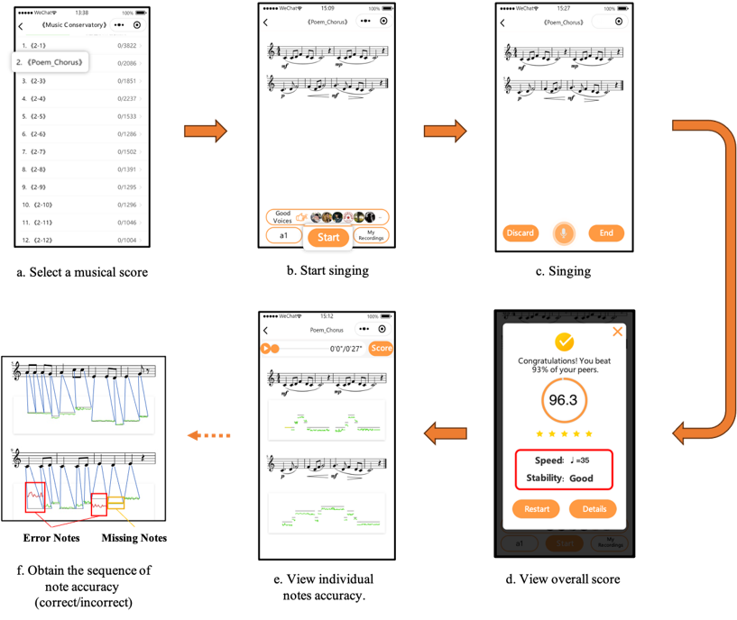

# The SPED dataset

## Introduction

Sight-singing is the process when a learner reads and sings a musical score at the same time. Most of the existing music datasets focus on note transcription tasks, only containing audio and pitch annotation. The SPED dataset is the first large-scale sight-singing dataset for performance evaluation, which contains 1,011 musical scores and 304,368 sight-singing recordings sung by by a total of 9,000 professional, semi-professional and inexperienced learners. The dataset focuses on learners' sight-singing performance data, and records the pitch and rhythm score sequences of the recordings, as well as the key signature, beat, and other music score information. The dataset can be used to analyze learners’ sight-singing ability, score difficulty, and can be applied in knowledge tracing tasks. The dataset is statistically analyzed and results reflect good consistency with general knowledge in the field of sight-singing, which indicates that the data quality meets expectations.

## Data Collection

The SPED dataset is based on the self-developed mini-program SingMaster, which has been collecting users’ sight-singing data since 2019. The SingMaster mini-program covers a rich variety of sight-singing materials, including classic sight-singing textbooks, as well as score collections from art exams, which ensures the musical score richness of the dataset. SingMaster caters to the needs of different user groups. It attracts a broad audience, including beginners with weak foundations, advanced users with a certain degree of musical literacy, as well as art examiners. This wide user base ensures the diversity of SPED.

 SingMaster collects user sightsinging information through the following steps: 1)User Login: The user logs in to the SingMaster system and chooses sightsinging books based on his interests. 2)Song Selection: The mini-program displays the available songs within the chosen book, allowing the user to select a specific song. 3)Music Score Display: The mini-program presents the music score to the user, who then begins to sight-sing the piece. 4)Real-time Evaluation: After the user completes sightsinging, SingMaster provides real-time evaluation and feedback on the performance. 5)Playback and Feedback: The user has the option to replay his recording and review the feedback. With the assistance of the algorithm, SingMaster offers note-level sightsinging evaluations, with pitches within the reference value thresholds shown in green, beyond the thresholds shown in red, timing missing shown in yellow, and missed notes shown in gray. Learners can utilize the feedback provided by SingMaster for AI-assisted sightsinging practice.

 

 ## Data description

Fields and descriptions of RecordingData.

| Field             | Description                                             |
|-------------------|---------------------------------------------------------|
| **id**            | Id of the sight-singing record.                         |
| **learner\_id**   | Learner id of the corresponding singer.                 |
| **score\_id**     | Record id of the corresponding music score.              |
| **score**         | Sequence of pitch scores to be recorded.                |
| **rhythm\_score**  | Sequence of duration scores.                           |
| **duration**      | Sequence of note duration.                              |
| **standard\_duration** | Sequence of standard duration.                      |
| **avg\_duration** | Average standard duration.                              |

Fields and descriptions of ScoreData.
| Field         | Description                                             |
|---------------|---------------------------------------------------------|
| **id**        | Id of the sight-singing score.                         |
| **pitch\_tag**| Pitch sequence for each note.                           |
| **rhythm\_tag**| Rhythm sequence of each note.                           |
| **mode**      | Information about the mode.                             |
| **beat**      | Beat information.                                       |
| **key\_signature** | Key signature information.                           |